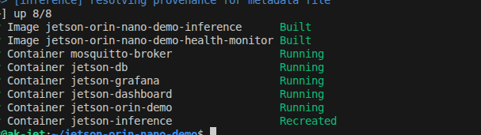
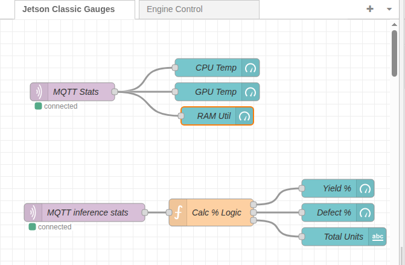
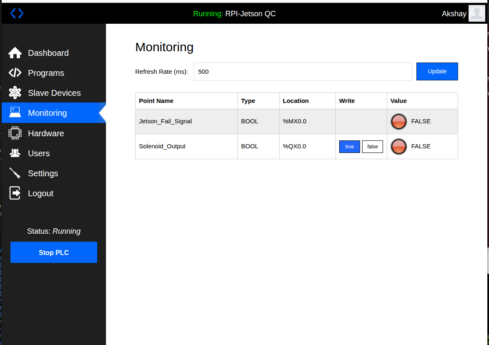

# Jetson Orin Nano Demo
This Project intends to showcase use of various technologies and tools on an edge device. There are better ways to do many of the things done in this project, some of the technologies(like Node-RED) may not be at all required but are included for demonstration and my understanding
## Live Dashboard
The live dashboard can be accessed on my website along with more(or less) information at [Jetson Orin Nano Live Dashboard](https://akshaykurhade.com/2025/12/29/nvidia-jetson-orin-nano-dashboard-and-demo-inference-server/)


---

##  Overview

# Jetson Orin Nano Demo

This project showcases the use of various technologies and tools on an edge device. It demonstrates direct hardware monitoring, microservices architecture, and real-time computer vision inference.

## Live Dashboard
The live dashboard is embedded on my website: [Jetson Orin Nano Live Dashboard](https://akshaykurhade.com/2025/12/29/nvidia-jetson-orin-nano-dashboard-and-demo-inference-server/)


---

## Overview

| Component | Technology | Role |
| :--- | :--- | :--- |
| **Data Producer** | Python 3.10 + `jtop` | Direct hardware sensor access (CPU/GPU/RAM). |
| **Inference Server** | Roboflow | GPU-accelerated engine optimized for Jetson. |
| **Inference Client** | Python + `inference-sdk`| Captures frames and publishing messages |
| **Local Logger** | Python `csv` module | Rotating logger for local failsafe storage. |
| **Messaging** | Mosquitto (MQTT) | Pub Sub communication between services. |
| **Node-RED** | Node-RED | Dashboard |
| **Database** | InfluxDB | High-performance time-series data storage.#NOTINUSE |
| **Visualization** | Grafana | Hardware monitoring and trend visualization.#NOTINUSE |
| **External Control** | OpenPLC | External RPi running Structured Text logic. |

---

## Computer Vision: 
### Living Room Cat Counter 
    The Living Room Cat Counter utilizes the Roboflow inference server Docker image optimized for the Jetson 6.2.x platform running the inference server. The model is YoloV8n trained on the COCO dataset
* **Server**: Uses the official Roboflow Jetson image,
* **Client**: A lightweight Python script that queries the server. It sends real-time counts to a MQTT which is ingested by a Node-RED server to display it on my website

### QC Dummy Server-
    The Dummy QC server classifies the good and the bad parts as PASS/FAIL, it currently looks for the red and green colors
    It uses Gstreamer, probably overkill but for the demonstration of use of the technology
    It uses the `PyModbusTCP` python library to create a client and write to a PLC (Currently a Raspberry Pi 4b running a emulator)
    

## Installation & Setup

### 1. Host System Preparation
Before running the containers, the `jetson-stats` service must be istalled and active on your host Jetson to provide hardware access.

```bash
# Update system and install jtop service
sudo apt update && sudo apt install -y python3-pip
sudo pip3 install -U jetson-stats

# Reboot to initialize the jtop service and permissions
sudo reboot
```
Create a file named `.env` in your repository to store you API key and other information you would not want to upload to the whole of internet
```Plaintext
ROBOFLOW_API_KEY=<Actual API KEY> #Find it under your Roboflow account
```
#### Containers
    All the services run in their individual containers as seen below.


### 2. System Setup
The `setup.sh` file details steps necessary to recreate the setup

### 3. Node-RED setup
1) Open the Node-Red server at http://<JETSON_IP>:1880 from any device or
[NodeRED_Localhost_server](http://localhost:1880) from the host device

2) Click on the hamburger menu(Three Lines)on the far right

3) Open `Manage Pallete` and install the modules `node-red-dashboard` and `node-red-contrib-influxdb`

4) From the hamburger menu click on `Import` and paste the contents of the file located under `assets/nodered_flow.json`

5) Save and Deploy. Your dashboard can now be accessed at  `http://<JETSON_IP>:1880/ui`



TODO- Documentation for MQTT-influxdb pipeline

### 4. Grafana Setup(WIP)
TODO

### 5. OpenPLC
Follow the tutorial by Dr. Don Wilcher [Reference Link to the article](https://control.com/technical-articles/turn-a-raspberry-pi-into-a-plc-using-openplc/)


## Access
### Dashboard Access
Once the stack is running, you can access the various interfaces via your browser using the Jetson's IP address:

Node-RED Dashboard: http://<JETSON_IP>:1880/ui

Grafana Dashboards: http://<JETSON_IP>:3000 (Default: admin/admin) 
> [!WARNING] Currently Not in use due to memory constraints

MQTT Explorer: Connect to mqtt://<JETSON_IP>:1883 

## Known Issues/Improvements/Design Choices/What Could have been done better

- Some browsers refuse to connect to the servers, try a different browser/device
- The Node-Red Dashboard uses a deprecated module `node-red-dashboard`, alternative is `@flowfuse/node-red-dashboard`
- The PLC section is just verified on software, Raspberry Pi is not the best choice for an end project, however should satisfy for demonstration
- The Structured Text program for unknown reason refused to compile with comments
- Attempted to use `@flowfuse/node-red-dashboard`, however the gauges had blank background and needle was just a period
- Was successfull setting up the Grafana Dashboard but it was overwhelming and would need more time and effort
- Camera Lock: Only one inference server (QC or Cat Counter) can access /dev/video0 at a time.
- Mobile Layout: Optimized for mobile viewing using a 12-column "stacked" group layout.
- Memory Management: Prevent OOM crashes

## TODO
- Documentation - Currently inconsistent
- Optimization - Heavy containers-look for alternatives, reuse
- QC inference server- Currently Dummy- replace with an actual QC server(seperate project)