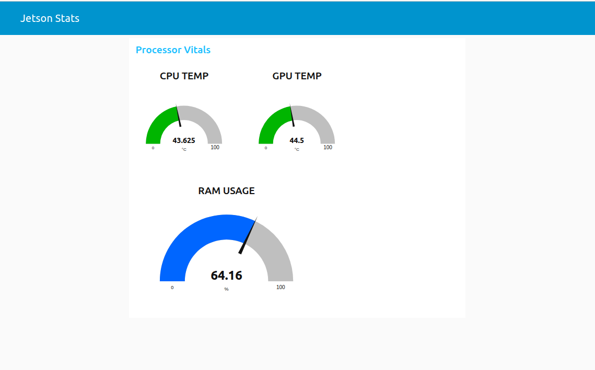

# Jetson Orin Nano Demo
This Project intends to showcase use of various technologies and tools on an edge device. There are better ways to do many of the things done in this project, some of the technologies(like Node-RED) may not be at all required but are included for demonstration and my understanding
## Live Dashboard
The live dashboard can be accessed on my website along with more(or less) information at [Jetson Orin Nano Live Dashboard](https://akshaykurhade.com/2025/12/29/nvidia-jetson-orin-nano-dashboard-and-demo-inference-server/)




---

##  Overview

| Component | Technology | Role |
| :--- | :--- | :--- |
| **Data Producer** | Python 3.10 + `jtop` | Direct hardware sensor access (CPU/GPU/RAM). |
| **Local Logger** | Python `csv` module | Use a local rotating logger to have failsafe but still save space |
| **Messaging** | Mosquitto (MQTT) | Decoupled communication between services. |
| **Node-RED** | Node-RED | Data transformation, UI Gauges, and DB Bridge. |
| **Database** | InfluxDB  | High-performance time-series data storage. |
| **Visualization** | Grafana | Dashboard,connects via Nodered Flow to the MQTT server |


---

## Installation & Setup

### 1. Host System Preparation
Before running the containers, the `jetson-stats` service must be istalled and active on your host Jetson to provide hardware access.

```bash
# Update system and install jtop service
sudo apt update && sudo apt install -y python3-pip
sudo pip3 install -U jetson-stats

# Reboot to initialize the jtop service and permissions
sudo reboot
```
### 2. Setup
The `setup.sh` file details steps necessary to recreate the setup

### 3. Node-RED setup
1) Open the Node-Red server at http://<JETSON_IP>:1880 from any device or
[NodeRED_Localhost_server](http://localhost:1880) from the host device

2) Click on the hamburger menu(Three Lines)on the far right

3) Open `Manage Pallete` and install the modules `node-red-dashboard` and `node-red-contrib-influxdb`

4) From the hamburger menu click on `Import` and paste the contents of the file located under `assets/nodered_flow.json`

5) Save and Deploy. Your dashboard can now be accessed at  `http://<JETSON_IP>:1880/ui`

TODO- Documentation for MQTT-influxdb pipeline

### 4. Grafana Setup(WIP)
TODO


## Access
### Dashboard Access
Once the stack is running, you can access the various interfaces via your browser using the Jetson's IP address:

Node-RED Dashboard: http://<JETSON_IP>:1880/ui

Grafana Dashboards: http://<JETSON_IP>:3000 (Default: admin/admin) #Currently WIP

MQTT Explorer: Connect to mqtt://<JETSON_IP>:1883 

## Known Issues
- Some browsers refuse to connect to the dashboard servers
- The Node-Red Dashboard uses a deprecated module `node-red-dashboard`, alternative is `@flowfuse/node-red-dashboard`